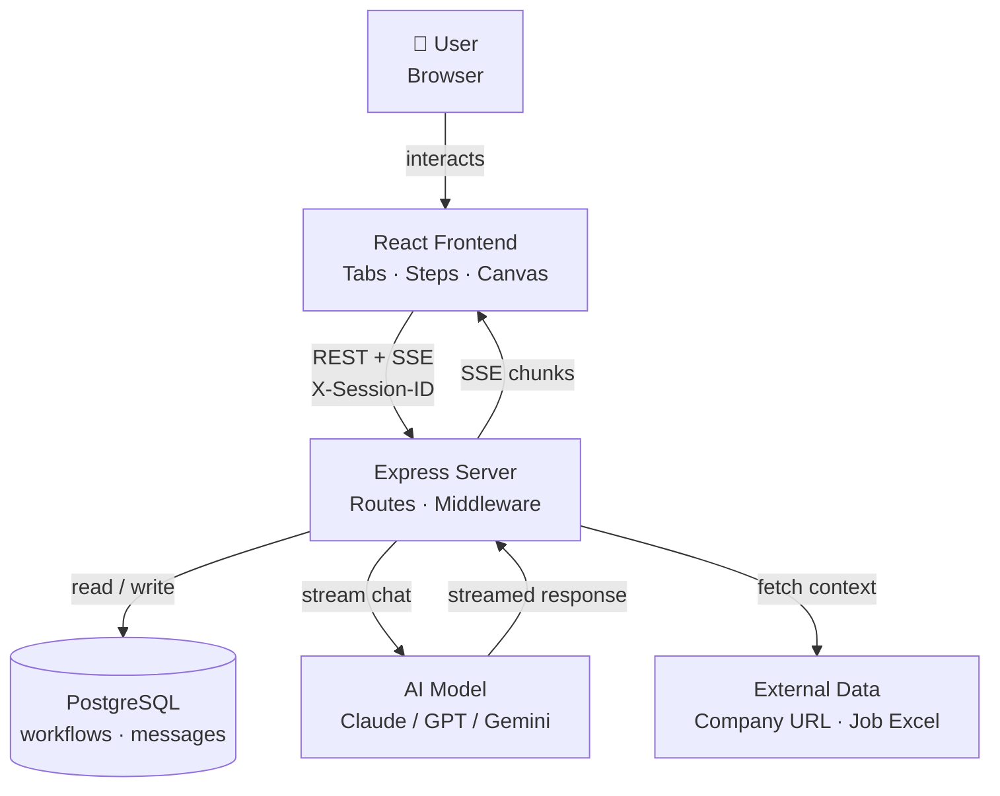
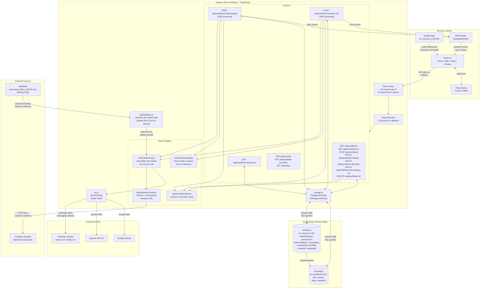
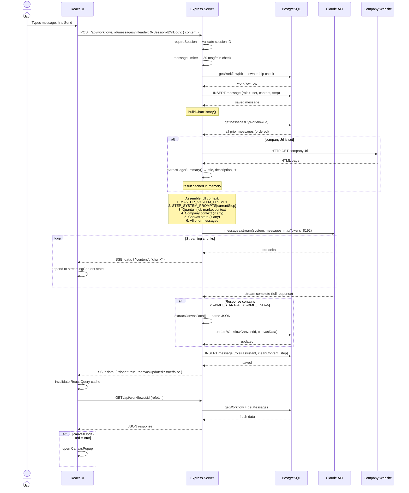
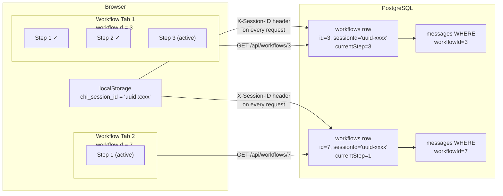
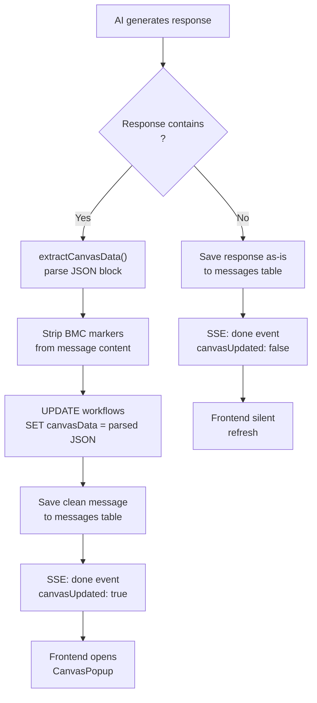

# CHI Quantum HR Workflow Assistant — System Diagram

## 1. Architecture Overview (Simplified)

---

## 2. Architecture Overview (Detailed)

---

## 2. Message Send Flow (Sequence)

---

## 3. Session & Multi-Tab Model

---

## 4. Business Model Canvas Update Flow

