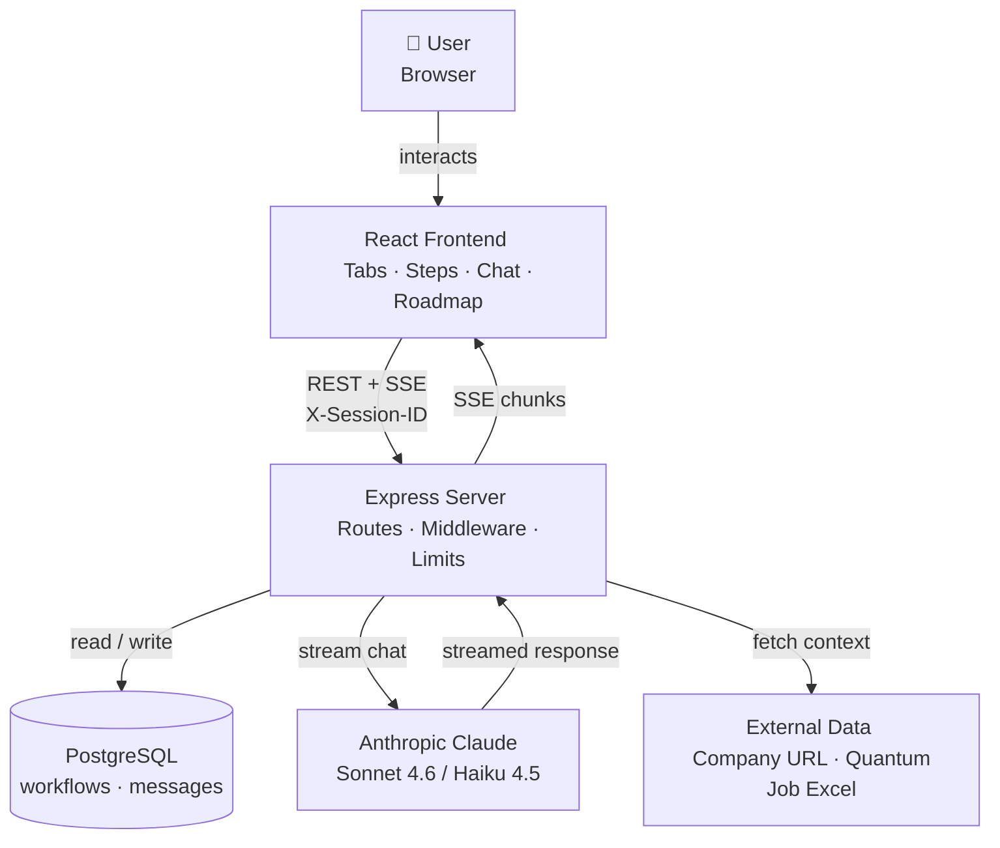
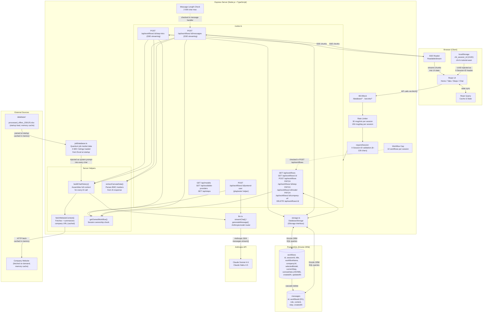
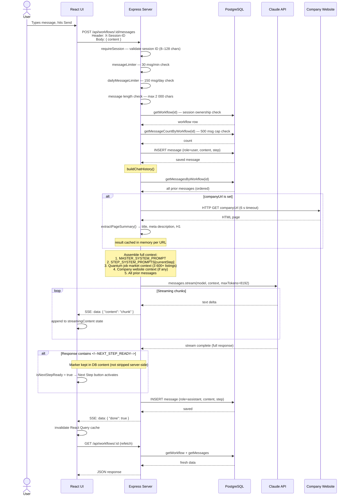
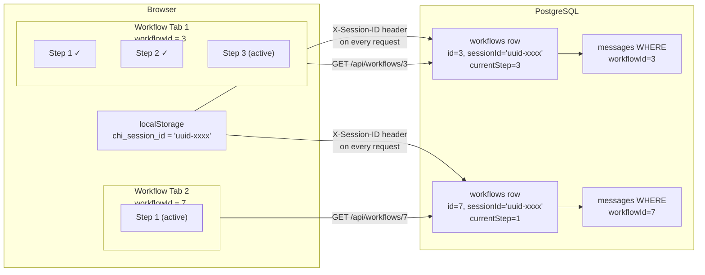
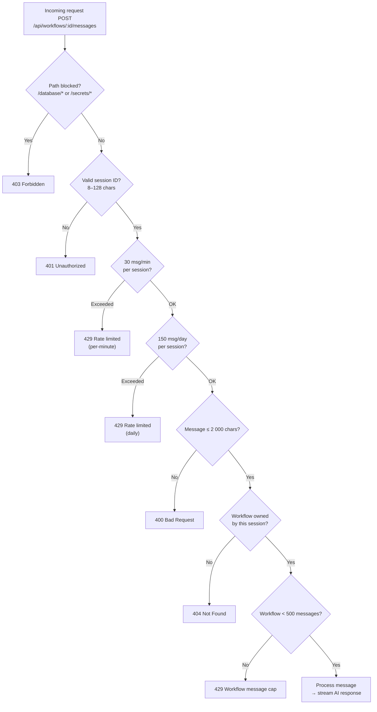
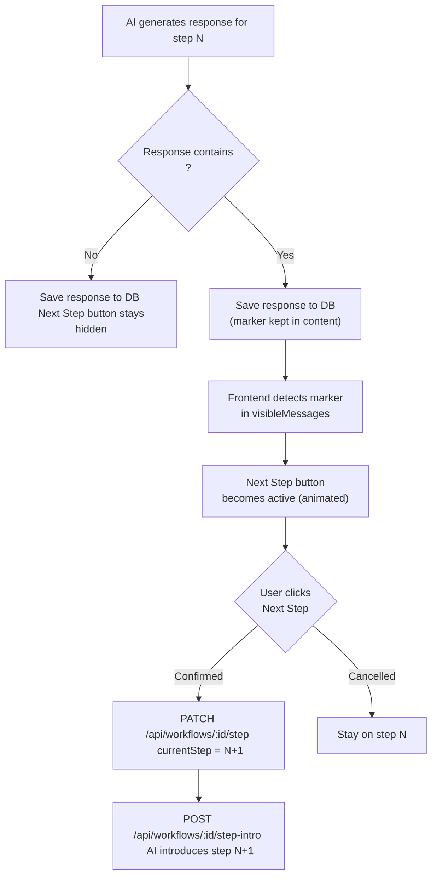

# CHI Quantum HR Workflow Assistant — System Diagram

## 1. Architecture Overview (Simplified)

---

## 2. Architecture Overview (Detailed)

---

## 3. Message Send Flow (Sequence)

---

## 4. Session & Multi-Tab Model

---

## 5. Rate Limiting & Abuse Prevention

---

## 6. Step Readiness Signal

